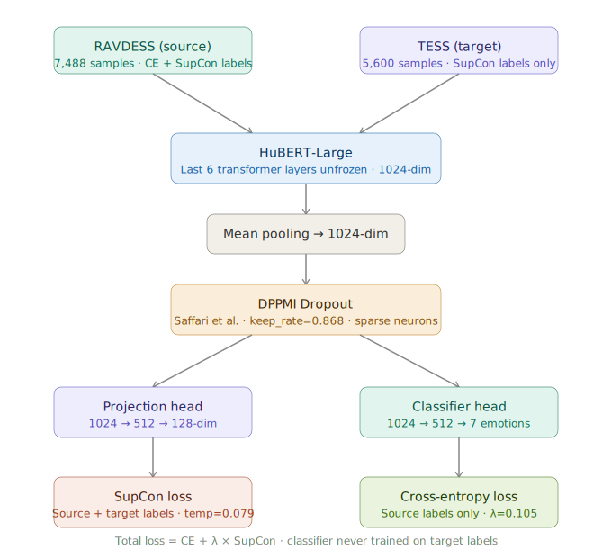

# Cross-Corpus Speech Emotion Recognition
## HuBERT + DPPMI Sparse Dropout + Supervised Contrastive Learning

[](https://python.org)
[](https://pytorch.org)
[](LICENSE)

---

## Overview

This project addresses **cross-corpus Speech Emotion Recognition (SER)** — training on one dataset (RAVDESS) and evaluating on a completely different one (TESS) across 7 shared emotion classes.

> **Setup:** Semi-supervised cross-corpus SER. Source (RAVDESS) labels used for CE + SupCon. Target (TESS) labels used in SupCon only — classifier never trained directly on target labels.

---

## Novel Contributions

1. **DPPMI Dropout for Speech** — First application of Saffari et al.'s DPPMI dropout to SER. Selects the most informative and diverse neurons via DPP + Mutual Information, producing sparse task-relevant representations robust to domain shift.

2. **Cross-Corpus SER with Supervised Contrastive Learning** — SupCon loss pulls same-emotion embeddings from both RAVDESS and TESS together, learning domain-invariant emotion clusters.

3. **Systematic Ablation** — 3-way comparison proving each component's contribution.

---

## Architecture



---

## Results

### Ablation Study (RAVDESS to TESS, 7 emotions)

| Model | Target Accuracy |
|-------|----------------|
| HuBERT Only | 59.91% |
| HuBERT + DPPMI | 61.34% |
| **HuBERT + DPPMI + SupCon** | **99.73%** |

### Per-Class Performance (Full Model)

| Emotion | Precision | Recall | F1 |
|---------|-----------|--------|----|
| Angry | 100.0% | 100.0% | 100.0% |
| Disgust | 100.0% | 94.4% | 97.1% |
| Fear | 99.4% | 100.0% | 99.7% |
| Happy | 99.4% | 99.4% | 99.4% |
| Neutral | 99.4% | 100.0% | 99.7% |
| Sad | 100.0% | 99.4% | 99.7% |
| Surprise | 95.0% | 99.4% | 97.2% |
| **Macro Avg** | **99.0%** | **99.0%** | **99.0%** |

---

## Datasets

| | RAVDESS (Source) | TESS (Target) |
|---|---|---|
| Files | 1,248 (aug. to 7,488) | 5,600 |
| Speakers | 24 actors | 2 speakers |
| Labels used | CE + SupCon | SupCon only |
| Test split | None | 20% held out |

**7 shared emotions:** angry, disgust, fear, happy, neutral, sad, surprise

---

## Hyperparameters (Optuna-tuned)

| Parameter | Value |
|-----------|-------|
| lr_hubert | 3.69e-05 |
| lr_head | 1.43e-04 |
| lambda_supcon | 0.105 |
| supcon_temp | 0.079 |
| keep_rate (DPPMI) | 0.868 |
| unfreeze_n | 6 |

---

## Setup

```bash
pip install torch transformers librosa scikit-learn optuna matplotlib seaborn pandas numpy joblib
```

Download datasets:
- [RAVDESS](https://zenodo.org/record/1188976) — Audio_Speech_Actors_01-24.zip only
- [TESS](https://www.kaggle.com/datasets/ejlok1/toronto-emotional-speech-set-tess)

Open notebooks/SER_Final.ipynb in Google Colab with A100 GPU.

---

## Project Structure

- `notebooks/SER_Final.ipynb` — 3-way ablation study (main)
- `notebooks/SER_V1.ipynb` — Initial experiments
- `results/json/` — Training histories and accuracy metrics
- `results/figures/` — Confusion matrices, F1 charts, architecture diagram

---

## Training Details

- **Hardware**: NVIDIA A100-SXM4-40GB
- **Optimizer**: AdamW with differential LR
- **Scheduler**: ReduceLROnPlateau
- **Audio**: 4.5s, 16kHz, silence-trimmed, loudness-normalized
- **Augmentation**: Gaussian noise, pitch shift, time stretch
- **Epochs**: 50 max, early stopping patience=10

---

## Acknowledgements

- DPPMI: Saffari et al., Purdue University Northwest
- SupCon: Khosla et al., NeurIPS 2020
- HuBERT: Hsu et al., Facebook AI Research, 2021
- RAVDESS: Livingstone & Russo, PLOS ONE 2018
- TESS: University of Toronto

---

## Author

**Shahwar** — MS ECE
GitHub: [Shahwar98](https://github.com/Shahwar98)
